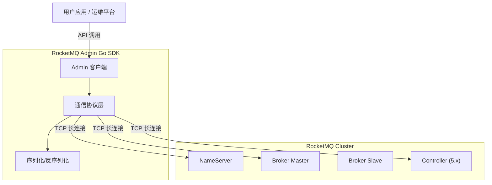

<div align="center">
  
  <h1>🚀 RocketMQ Admin Go</h1>
  <p><strong>专为 Go 语言打造的 Apache RocketMQ 运维管理客户端</strong></p>
  <p>全功能复刻 Java 版 <code>MQAdminExt</code> 能力，轻量、高效、零依赖。</p>

  <p>
    <a href="https://pkg.go.dev/github.com/codermast/rocketmq-admin-go">
      
    </a>
    <a href="https://goreportcard.com/report/github.com/codermast/rocketmq-admin-go">
      
    </a>
    <a href="LICENSE">
      
    </a>
    
  </p>

  <p>
    官方的 <a href="https://github.com/apache/rocketmq-client-go">rocketmq-client-go</a> 专注于消息的<strong>生产</strong>与<strong>消费</strong>，但在运维管理方面缺乏原生支持。<br>
    由此，本项目应运而生。
  </p>

</div>

## ✨ 核心特性

| 模块           | 功能亮点                                                         | 完成度 |
| :------------- | :--------------------------------------------------------------- | :----: |
| **基础运维**   | 集群状态监控、Broker 运行时信息、NameServer 配置管理             |   ✅    |
| **Topic 管理** | 创建/删除 Topic、路由查询、静态 Topic、Topic 权限控制            |   ✅    |
| **消费者管理** | 订阅组管理、消费进度监控、在线客户端查询、**重置消费位点**       |   ✅    |
| **消息操作**   | 消息轨迹查询、**消息直接消费**、死信队列处理、半消息恢复         |   ✅    |
| **权限安全**   | 完整的 ACL 用户管理、白名单/黑名单规则控制                       |   ✅    |
| **高级功能**   | KV 配置、Controller 模式管理 (5.x)、**冷数据流控**、RocksDB 调优 |   ✅    |


## 🛠️ 安装

```bash
go get github.com/codermast/rocketmq-admin-go
```

> 要求 Go 1.21 或更高版本。


## 🚀 快速开始

以下示例展示如何连接到 RocketMQ 集群并查询集群信息：

```go
package main

import (
    "context"
    "fmt"
    "log"
    "time"

    admin "github.com/codermast/rocketmq-admin-go"
)

func main() {
    // 1. 创建 Admin 客户端
    client, err := admin.NewClient(
        admin.WithNameServers([]string{"127.0.0.1:9876"}), // NameServer 地址
        admin.WithTimeout(5 * time.Second),                 // 请求超时时间
    )
    if err != nil {
        log.Fatalf("初始化失败: %v", err)
    }
    defer client.Close()

    // 2. 启动客户端
    if err := client.Start(); err != nil {
        log.Fatalf("启动失败: %v", err)
    }

    // 3. 执行运维操作：查询集群信息
    clusterInfo, err := client.ExamineBrokerClusterInfo(context.Background())
    if err != nil {
        log.Fatalf("查询异常: %v", err)
    }

    // 4. 输出结果
    fmt.Println("🚀 RocketMQ 集群概览:")
    for clusterName, brokerNames := range clusterInfo.ClusterAddrTable {
        fmt.Printf("Cluster: %s\n", clusterName)
        for _, brokerName := range brokerNames {
            brokerData := clusterInfo.BrokerAddrTable[brokerName]
            fmt.Printf("  └─ Broker: %s (Master: %s)\n", brokerName, brokerData.BrokerAddrs[0])
        }
    }
}
```

更多示例请参考 [examples](./examples) 目录。


## 🏗️ 架构概览




## 📚 技术文档

- [接口对照表](./docs/interfaces.md): 详细列出了所有支持的 Admin 接口及其实现状态。
- [协议实现解析](./docs/rocketmq_protocol.md): 深入解析 RocketMQ Remoting 协议的纯 Go 实现原理。


## 🤝 贡献与支持

欢迎提交 [Issue](https://github.com/codermast/rocketmq-admin-go/issues) 或 [Pull Request](https://github.com/codermast/rocketmq-admin-go/pulls) 改进本项目。

1. Fork 本仓库
2. 创建特性分支 (`git checkout -b feature/AmazingFeature`)
3. 提交更改 (`git commit -m 'Add some AmazingFeature'`)
4. 推送到分支 (`git push origin feature/AmazingFeature`)
5. 提交 Pull Request


## 📄 许可证

本项目采用 [Apache-2.0](./LICENSE) 许可证。

Copyright (c) 2026 CoderMast
