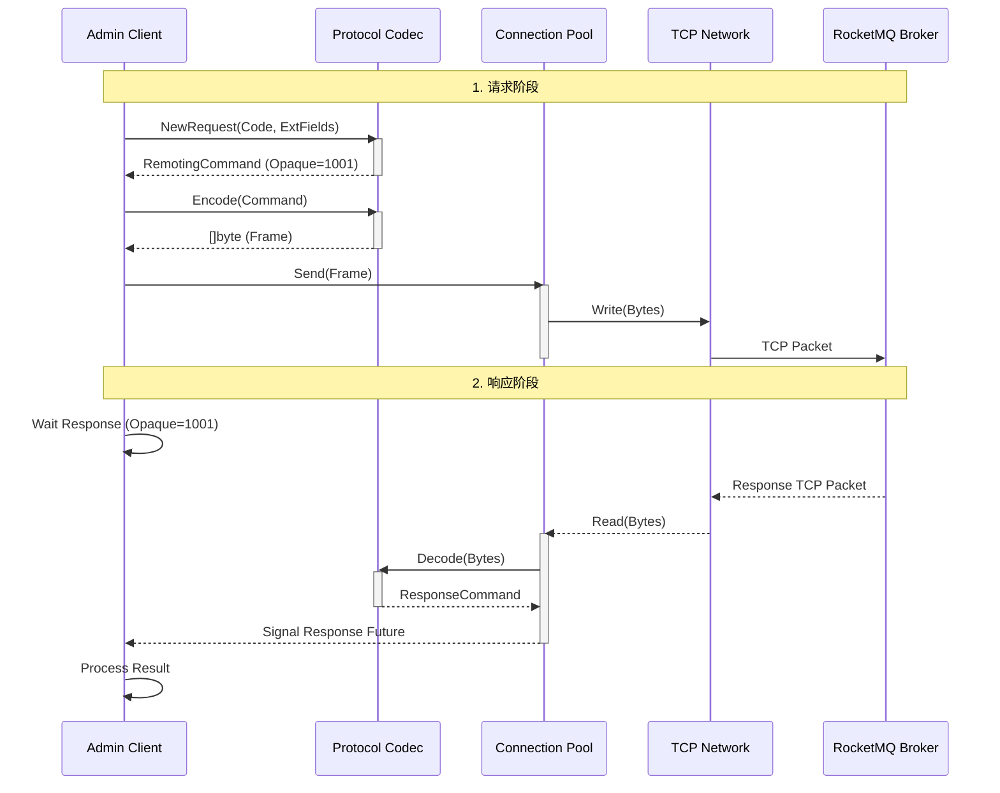

# RocketMQ Remoting 协议纯 Go 实现解析

RocketMQ 的通信层基于 Netty 实现，采用了自定义的二进制协议（Remoting Command）。本项目（RocketMQ Admin Go）为了实现轻量级和零依赖，**完全使用 Go 标准库 (`net` + `encoding/binary` + `encoding/json`) 原生重写了该协议**，没有引入任何第三方网络库。

本文档详细解析该协议的设计与 Go 语言实现细节。

## 1. 协议帧结构

RocketMQ 的协议帧由以下四部分组成：

```text
+----------------+----------------+---------------------+----------------+
|  Total Length  |  Header Length |    Header Data      |      Body      |
|    (4 Bytes)   |    (4 Bytes)   |  (JSON Serialized)  |  (Byte Array)  |
+----------------+----------------+---------------------+----------------+
```

### 1.1 Total Length (总长度)
- **类型**：`int32` (Big Endian)
- **含义**：表示后续数据的总长度（Header Length + Header Data + Body）。
- **作用**：解决 TCP 粘包/拆包问题的关键字段。

### 1.2 Header Length & Serialize Type
- **类型**：`int32` (Big Endian)
- **结构**：
  - **低 24 位**：Header Data 的长度。
  - **高 8 位**：序列化类型 (Serialize Type)。
    - `0`: JSON (当前实现仅支持 JSON)
    - `1`: RocketMQ 自定义序列化 (高性能，暂未实现)

### 1.3 Header Data
- **格式**：JSON 字符串的字节数组。
- **内容**：对应 `RemotingCommand` 结构体。包含了请求码（Code）、语言（Language）、版本（Version）、请求ID（Opaque）以及扩展字段（ExtFields）。

### 1.4 Body
- **格式**：原生字节数组。
- **内容**：业务载荷，例如消息内容、路由信息等。

## 2. Go 语言实现

核心实现位于 `protocol/remoting/command.go`。

### 2.1 结构体定义

```go
type RemotingCommand struct {
    Code      int               `json:"code"`      // 请求/响应码
    Language  string            `json:"language"`  // 客户端语言 (GO)
    Version   int               `json:"version"`   // 协议版本
    Opaque    int32             `json:"opaque"`    // 请求 ID (原子自增)
    Flag      int               `json:"flag"`      // 标志位 (RPC/Oneway)
    Remark    string            `json:"remark"`    // 备注
    ExtFields map[string]string `json:"extFields"` // 扩展字段
    Body      []byte            `json:"-"`         // 消息体 (不参与 JSON 序列化)
}
```

### 2.2 编码过程 (Encode)

```go
func (cmd *RemotingCommand) Encode() ([]byte, error) {
    // 1. 序列化 Header
    headerBytes, _ := json.Marshal(cmd)
    
    // 2. 计算长度
    // 协议规定：TotalLength = 4 (HeaderLengthField) + Len(Header) + Len(Body)
    headerLen := len(headerBytes)
    bodyLen := len(cmd.Body)
    totalLen := 4 + headerLen + bodyLen

    // 3. 分配缓冲区 (TotalLengthField + TotalLength)
    buf := make([]byte, 4+totalLen)

    // 4. 写入 Length (BigEndian)
    binary.BigEndian.PutUint32(buf[0:4], uint32(totalLen))

    // 5. 写入 Header Length & Serialize Type (JSON=0)
    // 高 8 位为 0 (JSON)，直接写入 headerLen
    binary.BigEndian.PutUint32(buf[4:8], uint32(headerLen)) 

    // 6. 写入 Header Data 和 Body
    copy(buf[8:], headerBytes)
    if bodyLen > 0 {
        copy(buf[8+headerLen:], cmd.Body)
    }

    return buf, nil
}
```

### 2.3 解码过程 (Decode)

解码过程主要用于处理 Broker 返回的响应。

```go
func Decode(data []byte) (*RemotingCommand, error) {
    // 1. 读取 Header Length (忽略高8位序列化类型，假设为JSON)
    headerLen := int(binary.BigEndian.Uint32(data[0:4]) & 0x00FFFFFF)

    // 2. 解析 Header
    cmd := &RemotingCommand{}
    json.Unmarshal(data[4:4+headerLen], cmd)

    // 3. 读取 Body
    if len(data) > 4+headerLen {
        cmd.Body = data[4+headerLen:] // 剩余部分即为 Body
    }

    return cmd, nil
}
```

## 3. 请求处理流程

### 3.1 交互时序图



Go 客户端与 Broker 交互的完整流程如下：

1. **连接建立**：通过 `net.DialTimeout` 建立 TCP 连接。
2. **请求构建**：
   - 创建 `RemotingCommand`。
   - 填充 `Code` (如 `GetBrokerClusterInfo = 106`)。
   - 使用 `atomic.AddInt32` 生成唯一 `Opaque`。
3. **编码发送**：调用 `Encode()` 生成字节流，通过 `conn.Write` 发送。
4. **同步等待**：
   - 客户端在一个 Loop 中读取 `conn`。
   - 先读 4 字节获取 `TotalLength`。
   - 再读取 `TotalLength` 长度的剩余数据。
   - 解码得到 `ResponseCommand`。
   - 根据 `Opaque` 匹配请求与响应 (这也是 `ConnectionPool` 和 `Future` 模型的核心)。

## 4. 优势

1. **轻量级**：仅依赖 Go 标准库，编译产物极小。
2. **可控性**：完全掌控协议细节，方便调试和扩展（如支持新的压缩算法）。
3. **高性能**：直接操作 TCP 流，避免了复杂的框架开销。

---
> 纯 Go 实现的魅力在于，它让我们看清了看似复杂的分布式系统底层，其实就是字节在网络上的舞蹈。
